# Cargo Service

#### Credentials for demo:

> Username: Demouser
> 
> Password: 1qazcde3

Cargo Service is a Django-based web application for managing cargo transportation.
Drivers can rent trucks, take available orders based on truck capacity, and track order status in real time.
The project focuses on clear business logic, data consistency, and practical backend architecture.

## Diagram

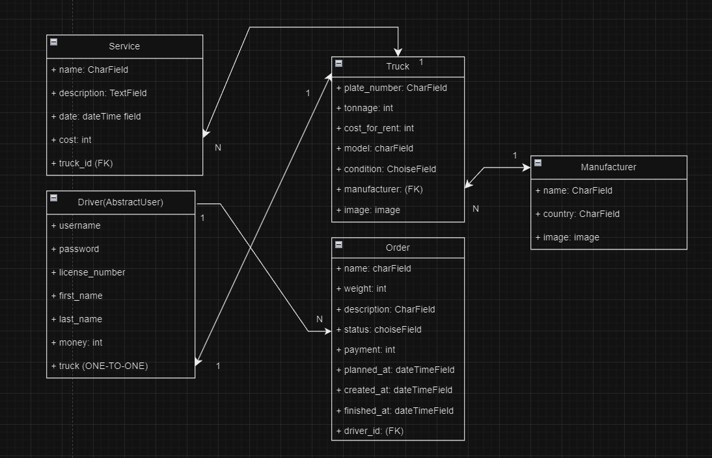


## Quick start


```shell

1. Clone project `git clone https://github.com/AngryAndrii/cargo-service.git`.
2. Create and activate virtual environment.
3. Install requirements `pip install requirements.txt`
4. Run migrations: `python manage.py migrate`
5. Load the dumped data back to database: `python manage.py loaddata dump.json`
6. Run the project: `python manage.py runserver`
```

## Application functionality

After entering the site, we find ourselves on the login page.
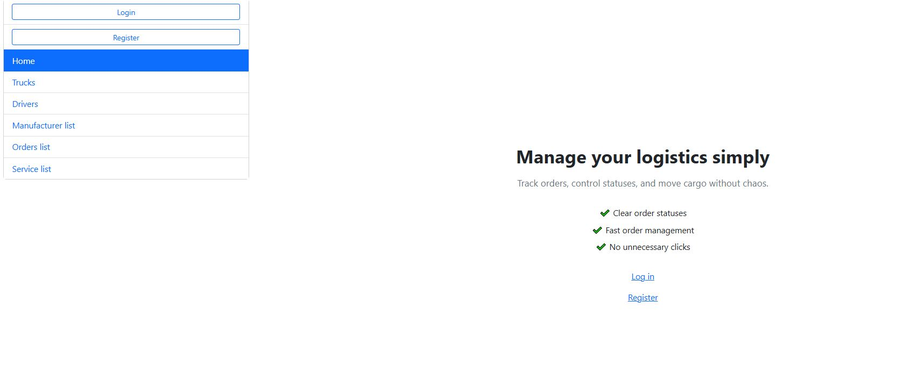

Register to the site or login if you've already registered  
***after registration you should login!***

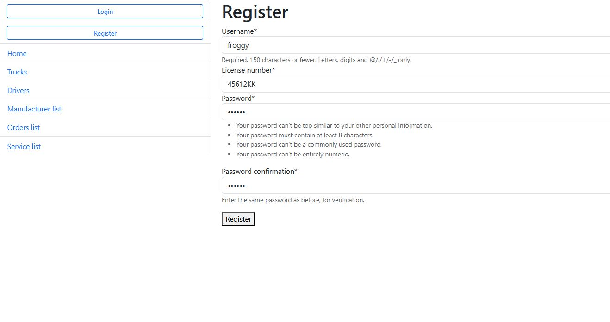

after that we will be on the main page

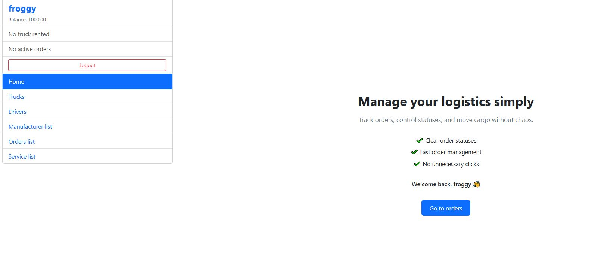

After that we can go to trucks page to rent a car. 
The list of cars is displayed in 5 pieces, and with loading via a button

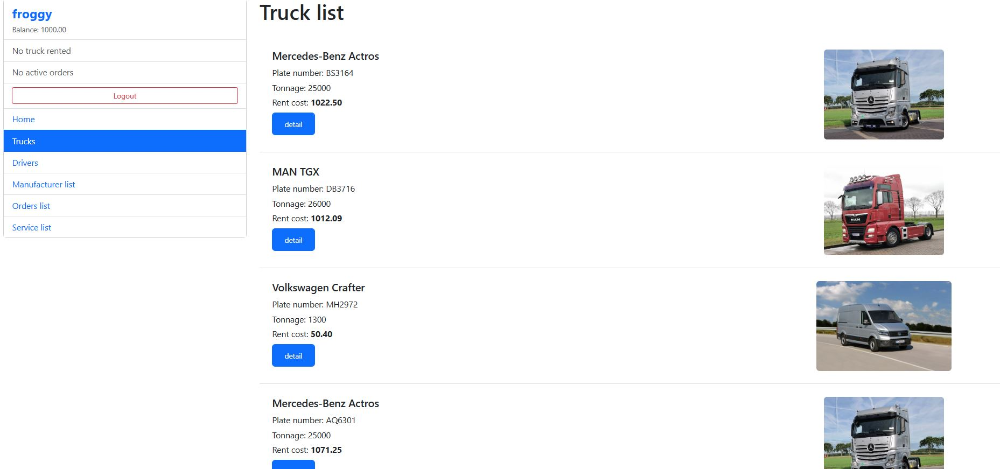

On the driver page we can see list of drivers

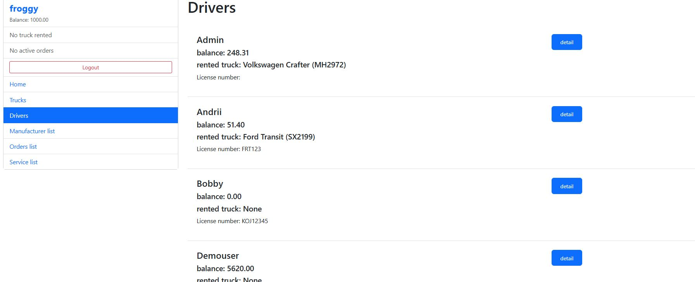

you can also go to the detailed driver review page

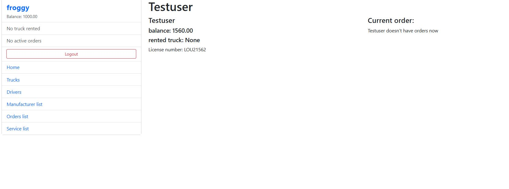


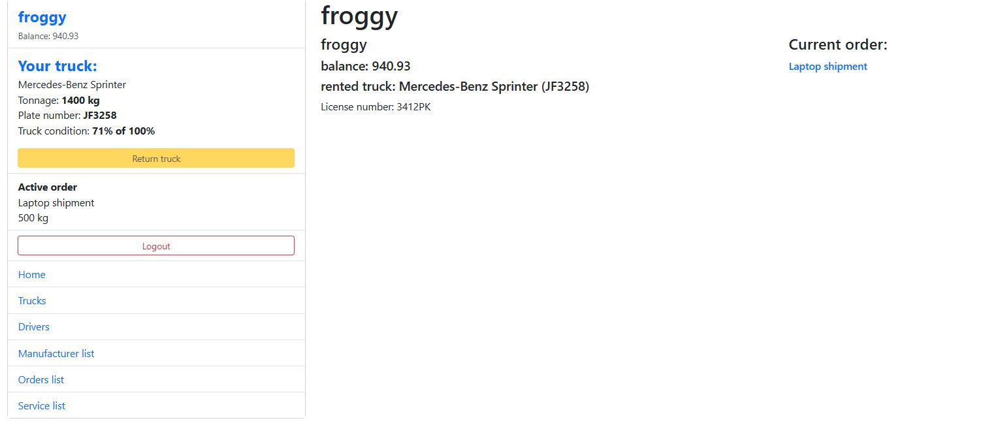
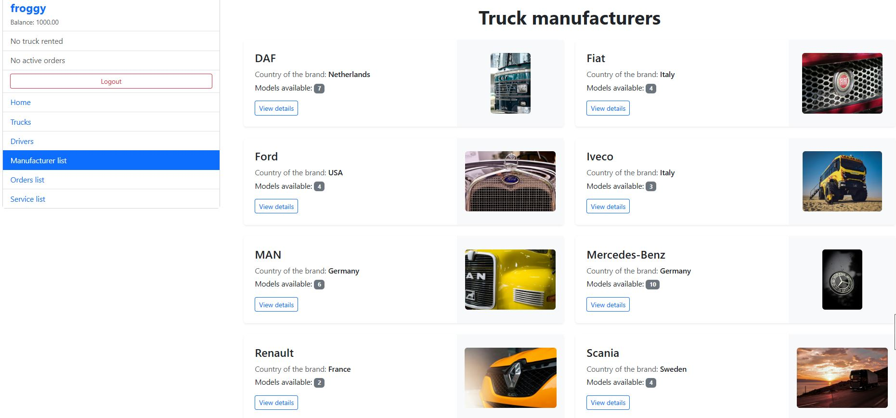
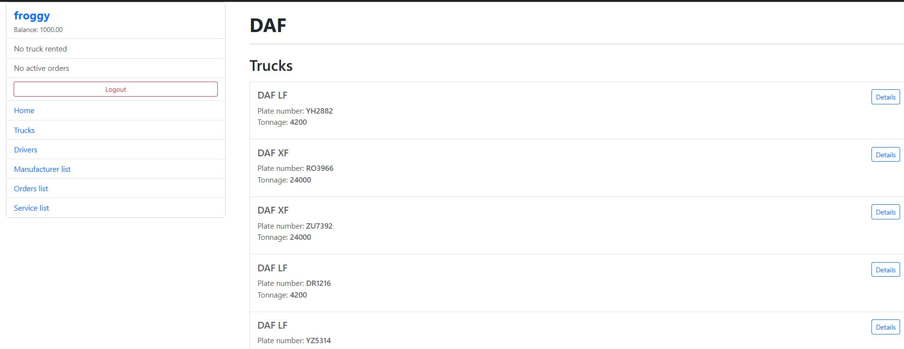
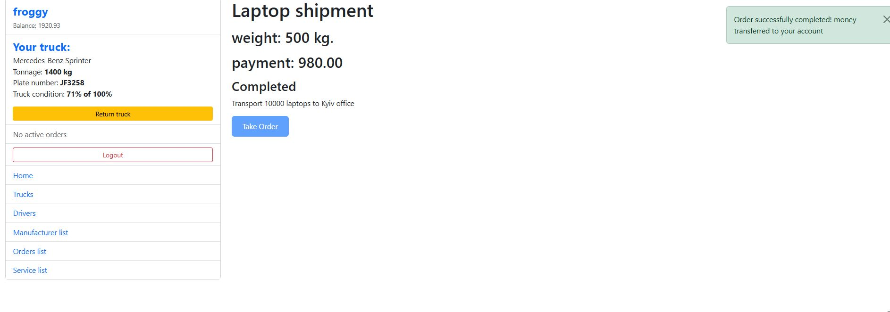
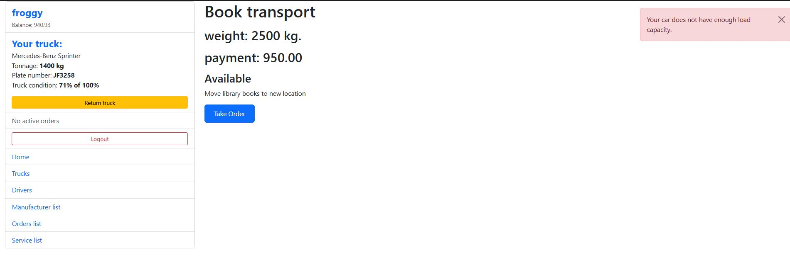
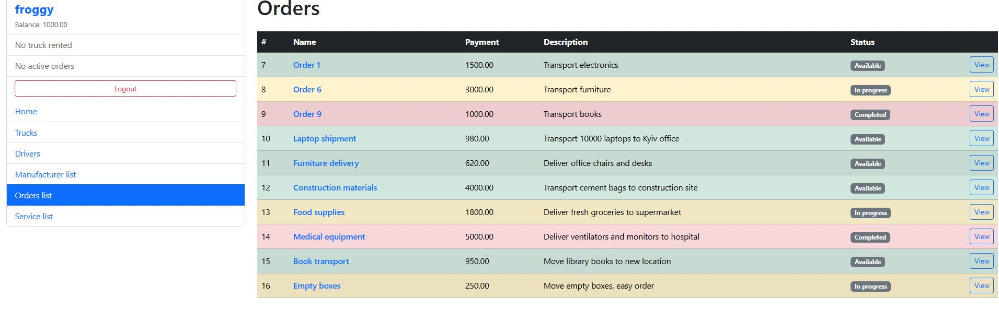
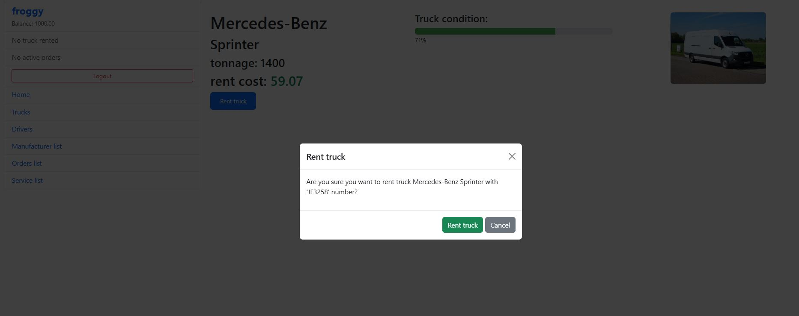
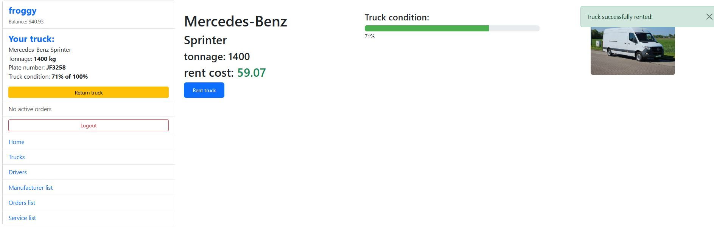


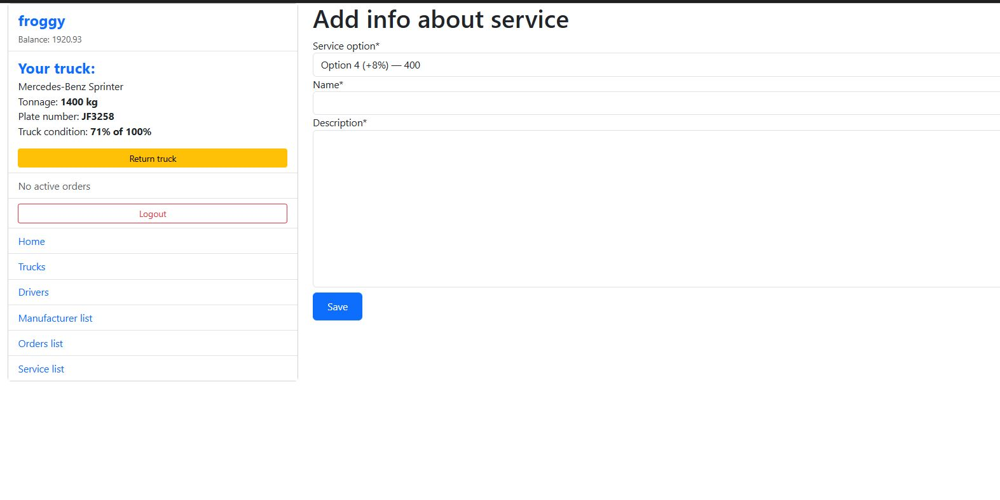

.JPG)

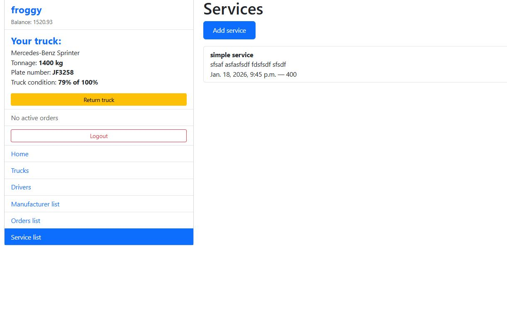


we can rent any car if it is not occupied by another driver, in which case we will get an error
After that, in sidebar we can see our rented truck, and our just get smoller (with a transaction)
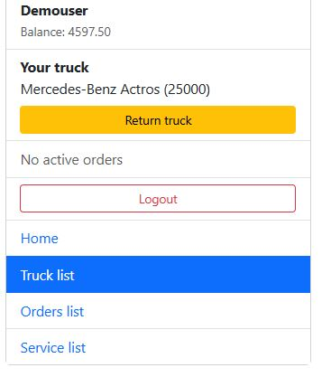

Now we can go to the orders page. All requests differ in color and status, some are already being 
fulfilled by other drivers. We can choose from green (available)
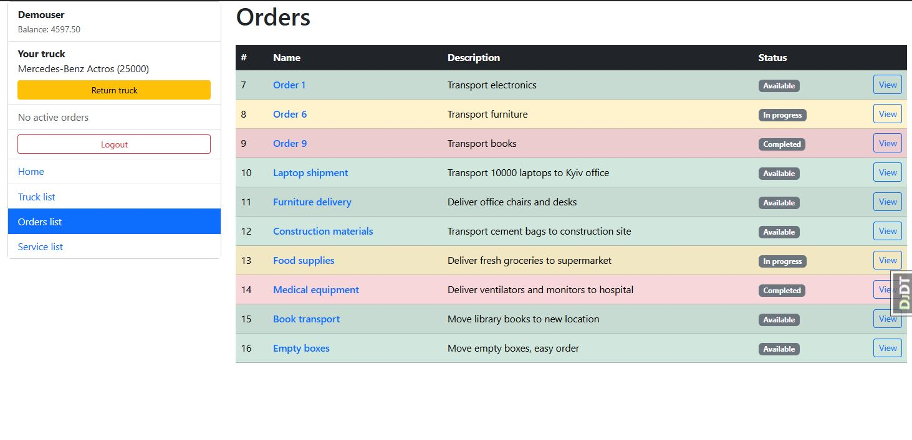

Oh, great order, metal rails. But what is this? The weight is almost 30 tons, and our truck is designed for less. 
When you try to take this order, an error message will be displayed.
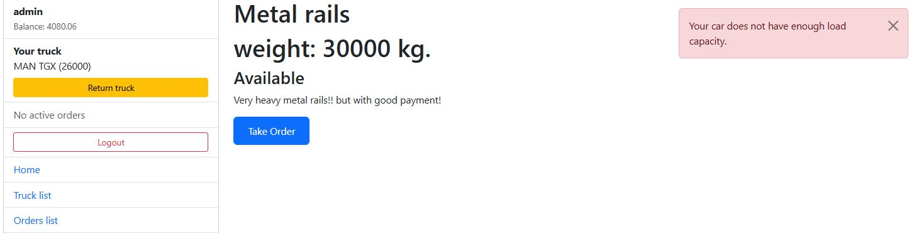

So let's choose something easier. After receiving the order, we see a message, and its display in the sidebar
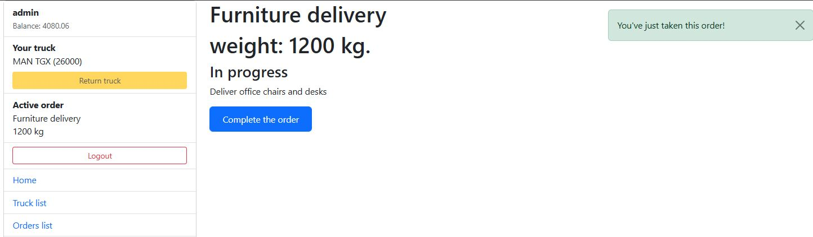

Now we will assume that we have completed the order, click the completed order button 
(by the way, confirmation of all actions occurs through modal windows)
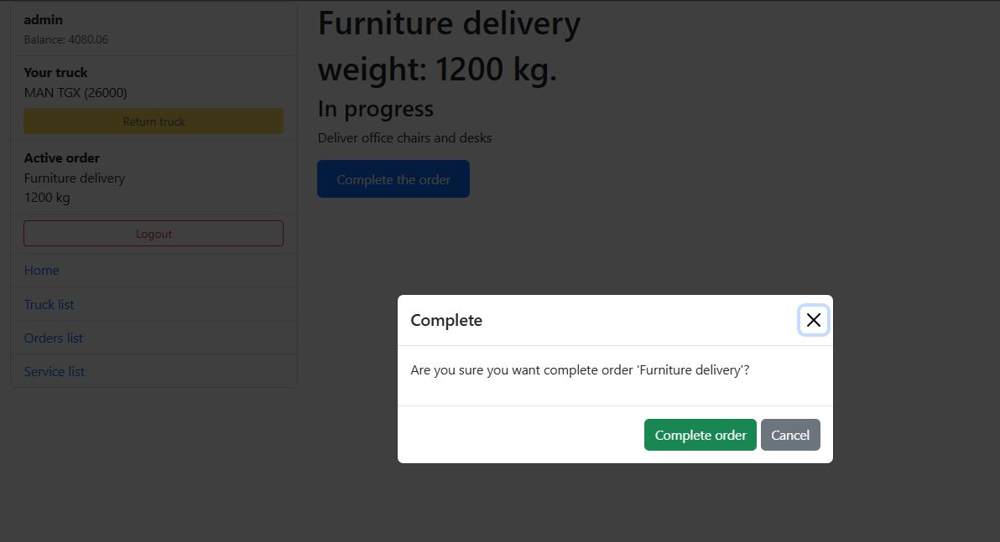
The order goes into the completed status, and money is added to our account, this is visible in the sidebar
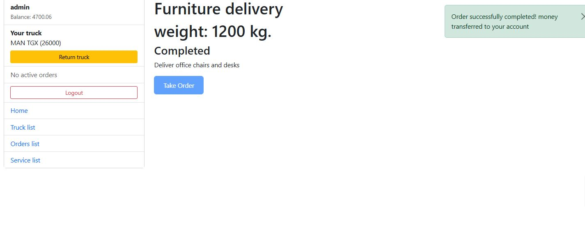
